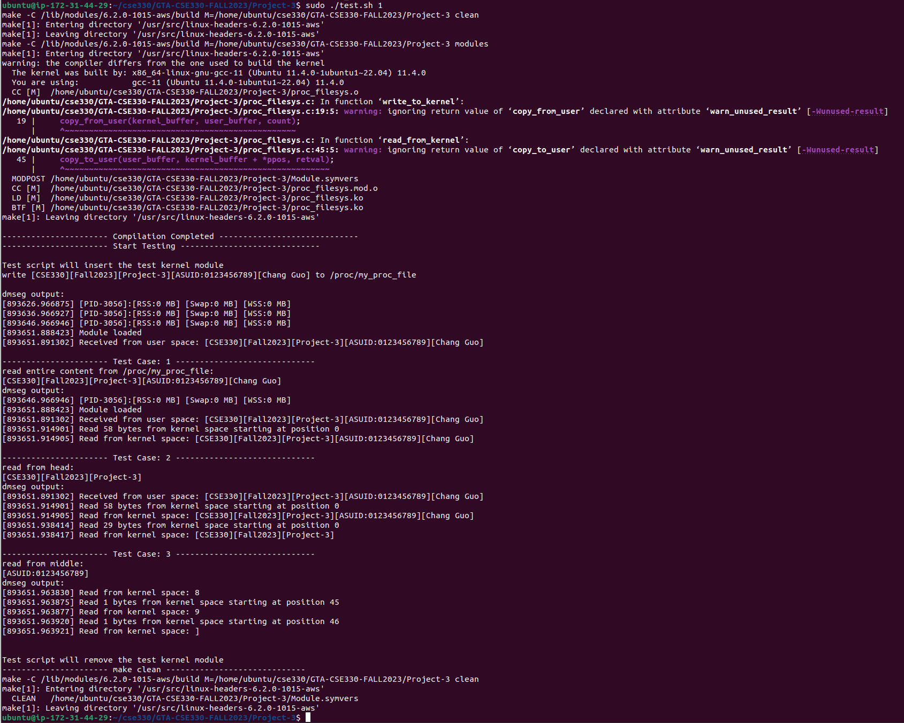
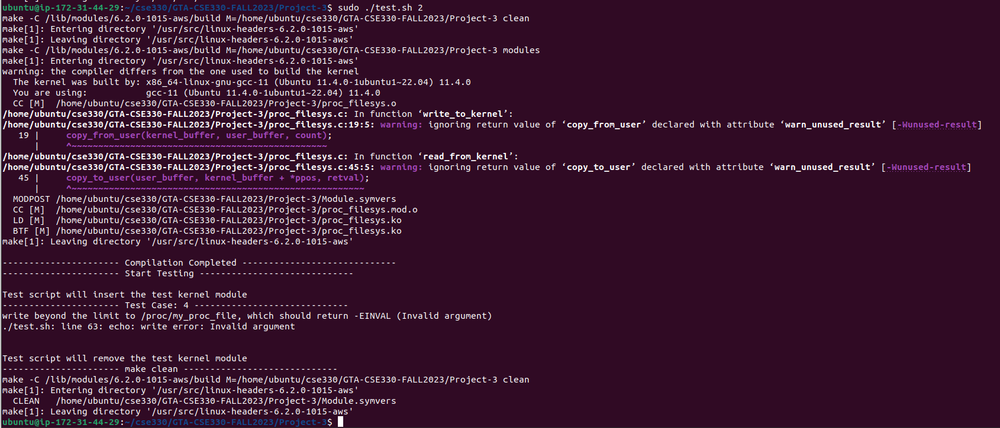
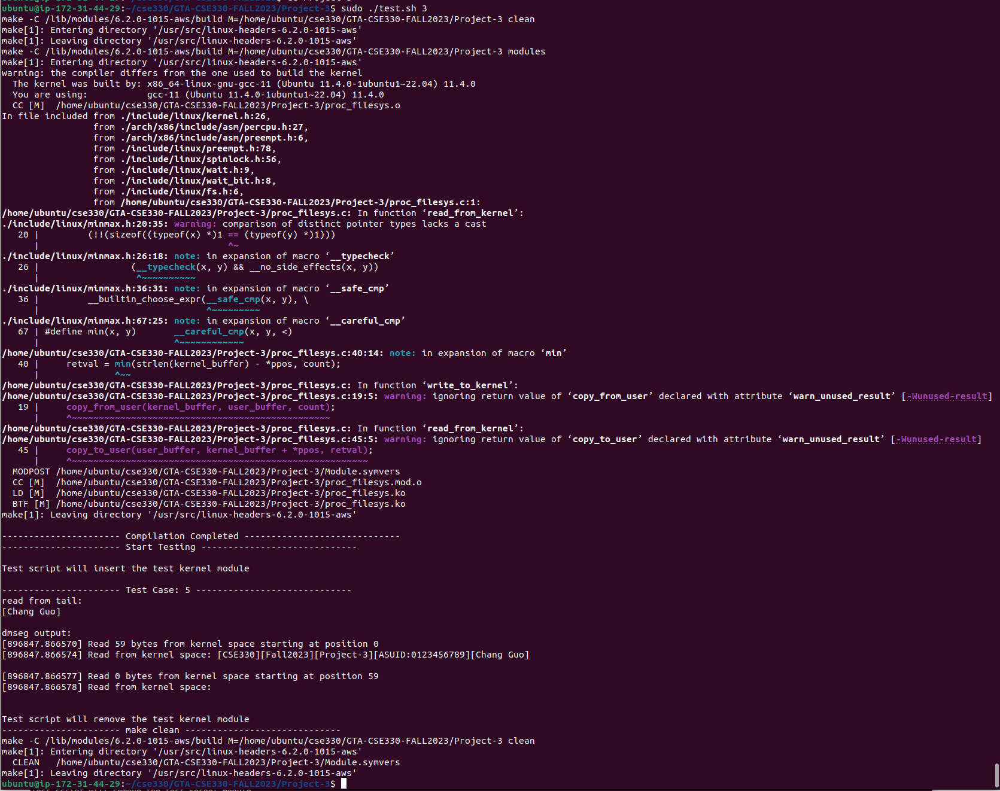

# CSE330: Operating Systems 

Please follow the below steps to test your Project-3. 

- Download the zip of this git repository.
- Unzip the repository.
- Implement your kernel module code in the proc\_filesys.c (i.e. all //TODO part, DO NOT change any other part).
- Modify **Your_Name** and **ASU_ID** in the test.sh, and then run the test.sh script with the test arguments. 

## Test Cases:

| Test Case #   | Test Command  | Test Criteria  | Total Points |
| ------------- |:-------------:| :-----:|:-----:|
| 1, 2, 3 | sudo ./test.sh 1 | write to kernel (25 pts); read entire content (25 pts); read from head (25 pts); read from middle (25 pts) | 100 |
| 4 | sudo ./test.sh 2 | **Bonus**! write beyond the size limit, return: Invalid argument | **0.5 extra point of your CSE330 final total grades** |
| 5 | sudo ./test.sh 3 | **Bonus**! read from tail | **0.5 extra point of your CSE330 final total grades** |

## Note: 
- You can use print statements in case you want to debug and understand the logic of the test code.
- Please get in touch with the TAs if you face issues in using the test scripts.

## Sample Output Screenshots:

### Test Case 1

### Test Case 2

### Test Case 3

